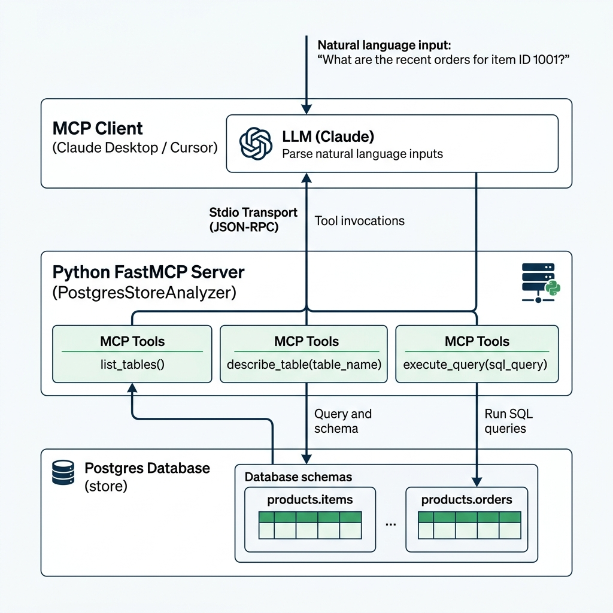

# PostgreSQL MCP Server (Store Analyzer)

This is a Model Context Protocol (MCP) server built with **Python** and **FastMCP** to connect to a PostgreSQL database containing a retail store dataset. It exposes database inspection and querying tools to MCP clients (like Claude Desktop, Cursor, or LibreChat), allowing non-technical team members to analyze database tables, schemas, and query data using natural language.



---

## Features

* **Schema Auto-Discovery**: Let AI explore tables (`list_tables`) and inspect column constraints/descriptions (`describe_table`).
* **Query Safeguard**: Automatically rejects any mutating queries (`INSERT`, `UPDATE`, `DELETE`, `DROP`, etc.) at the server layer.
* **Friendly Outputs**: Automatically formats query result rows as clean, aligned Markdown tables.
* **Smart Search Path**: Set to automatically route queries to the `products` schema, so users can type `SELECT * FROM items` instead of `SELECT * FROM products.items`.

---

## Project Structure

```text
mcp/
├── pyproject.toml         # Dependencies managed by uv
├── .env                  # DB Connection credentials
├── .env.example          # Template credentials
├── src/
│   ├── database.py       # DB connections, schema queries & safety filters
│   └── server.py         # FastMCP server & tool definitions
└── docker/
    ├── docker-compose.yml # Runs PostgreSQL local container
    └── init.sql          # Seed retail database, schema & mock records
```

---

## Quick Start (Local Demo)

### 1. Prerequisites
Ensure you have the following installed:
* [Docker & Docker Compose](https://www.docker.com/)
* [Python 3.10+](https://www.python.org/)
* [uv](https://docs.astral.sh/uv/) (highly recommended Python package manager)

### 2. Start PostgreSQL Container
Spin up the PostgreSQL server on port `5435` with seed data:
```bash
cd docker
docker compose up -d
```

Verify that the database is running:
```bash
docker ps --filter "name=postgres-mcp-store"
```

### 3. Initialize environment
Create your local environment file:
```bash
cp .env.example .env
```
*(The default values in `.env` are configured to connect to your local Docker container on port `5435`).*

### 4. Run MCP Inspector (Test the server)
The **MCP Inspector** is a browser-based GUI that lets you interactively test the server tools (`list_tables`, `describe_table`, `execute_query`) without setting up a chat client yet.

Run this command from the root directory (`/Users/sivajanapati/AI_Learning/postgres-store-analyzer`):
```bash
npx -y @modelcontextprotocol/inspector uv run python src/server.py
```

This will output a localhost URL (e.g. `http://localhost:5173`). Open this URL in your web browser:
1. Under **Tools**, select `list_tables` and click **Run Tool**. You'll see the available tables.
2. Select `describe_table` and input `table_name: items` to inspect columns and foreign keys.
3. Select `execute_query` and input `sql_query: SELECT * FROM items LIMIT 5` to run query tests.
4. Try to write: `sql_query: DELETE FROM items`. You will see it successfully gets blocked by the security safeguard.

---

## Integrating with LLM Clients (e.g. Claude Desktop)

To enable your team to query the database using natural language:

### 1. Configure Claude Desktop
Open your Claude Desktop configuration file.
* **macOS config path**: `~/Library/Application Support/Claude/claude_desktop_config.json`
* **Windows config path**: `%APPDATA%\Claude\claude_desktop_config.json`

Since the VS Code command line (`code`) might not be installed, you can open this file in terminal using `vi` or Mac's TextEdit:
```bash
# Using Mac's TextEdit editor:
open -e ~/Library/Application\ Support/Claude/claude_desktop_config.json

# Or using vi in the terminal:
vi ~/Library/Application\ Support/Claude/claude_desktop_config.json
```

Paste the following JSON block inside the file. If the file is empty, paste the entire block. If it already has other servers, add the `"postgres-store-analyzer"` configuration inside the `"mcpServers"` object:

```json
{
  "mcpServers": {
    "postgres-store-analyzer": {
      "command": "/Users/sivajanapati/.local/bin/uv",
      "args": [
        "--directory",
        "/Users/sivajanapati/AI_Learning/postgres-store-analyzer",
        "run",
        "python",
        "src/server.py"
      ]
    }
  }
}
```

*(Note: We use the absolute path `/Users/sivajanapati/.local/bin/uv` because Claude Desktop runs in an isolated path environment and needs the full path to locate `uv`).*

### 2. Restart Claude Desktop
1. **Fully Quit Claude Desktop**: Go to the top Mac menu bar, click **Claude** and select **Quit Claude** (or press **`Cmd + Q`**). *Just closing the window will not apply the changes.*
2. Open Claude Desktop again.
3. Look for a **plug icon** 🔌 in the bottom-right corner of the chat input box. Hovering over it should show `postgres-store-analyzer` is connected!

---

## Example Prompts for Non-Technical Users

Now you can ask the AI questions like:
* *"What tables are in our store database?"*
* *"Who is our highest-spending customer, and where are they from?"*
* *"Which product category has generated the most revenue?"*
* *"Show me a list of all products that have less than 30 items in stock."*
* *"How many orders did we get in CA compared to NY?"*

---

## Security Best Practices

1. **Database-Level Restrictions (Recommended)**: In production environments, always connect the MCP server using a **read-only database role**. You can create one in PostgreSQL with:
   ```sql
   CREATE ROLE mcp_readonly_user WITH LOGIN PASSWORD 'your_secure_password';
   GRANT CONNECT ON DATABASE store TO mcp_readonly_user;
   GRANT USAGE ON SCHEMA products TO mcp_readonly_user;
   GRANT SELECT ON ALL TABLES IN SCHEMA products TO mcp_readonly_user;
   ALTER DEFAULT PRIVILEGES IN SCHEMA products GRANT SELECT ON TABLES TO mcp_readonly_user;
   ```
2. **Server-Level Restrictions**: Our Python implementation in `src/database.py` validates that every query starts with `SELECT` or `WITH`, and scans queries for keywords like `INSERT`, `DELETE`, `UPDATE`, `DROP`, `ALTER`, etc., blocking execution if any are present.
